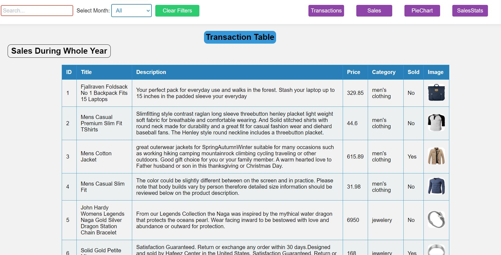
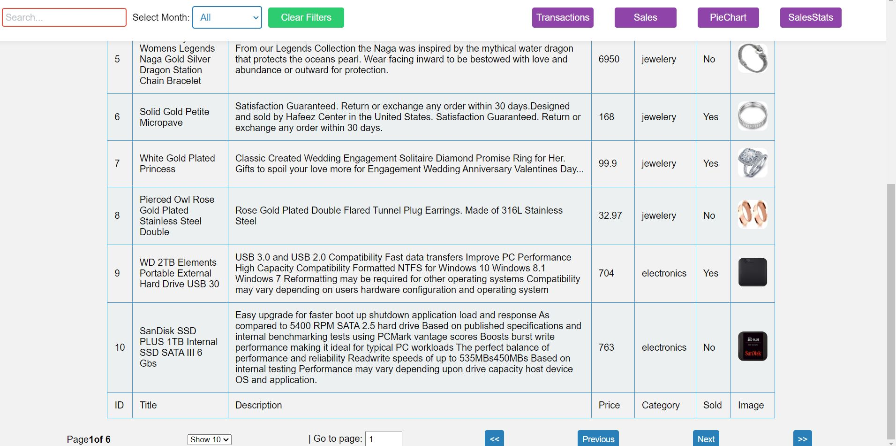
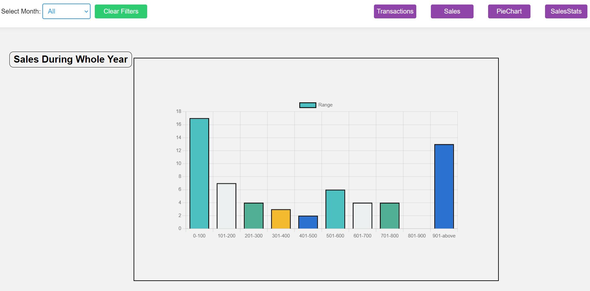

# MERN Transaction Table Web App

## Overview

This MERN (MongoDB, Express.js, React.js, Node.js) Transaction Table Web App provides a comprehensive view of transactions, sales statistics, and insightful visualizations such as bar and pie charts. Developed as part of a coding challenge, the application interacts with a third-party API to fetch product transactions data, initializes the database, and implements various APIs to cater to diverse functionalities.

## Backend

### Data Source

**Third-Party API URL:** [Product Transactions API](https://s3.amazonaws.com/roxiler.com/product_transaction.json)  
**Request Method:** GET  
**Response Format:** JSON

### API Endpoints

1. **Initialize Database API**

   - **Method:** GET
   - **Description:** Fetches JSON data from the third-party API and initializes the database with seed data.

2. **List All Transactions API**

   - **Method:** GET
   - **Description:** Lists all transactions with support for search and pagination based on product title, description, price, and the selected month.

3. **Statistics API**

   - **Method:** GET
   - **Description:** Provides total sale amount, total number of sold items, and total number of unsold items for the selected month.

4. **Bar Chart API**

   - **Method:** GET
   - **Description:** Returns the number of items in different price ranges for the selected month.

5. **Pie Chart API**

   - **Method:** GET
   - **Description:** Displays sales on the basis of categories for the selected month.

6. **Combined Data API**
   - **ISSUE:** As per the problem statement here i have to fetch from the above 3 api and give the result but i am confused here how can i pass the paramenter at backend
     i will try here and do it with two ways
   - **1 :** Getting all information in one api then calculate for three but again this calculation is easy at frontend how can i perform at backend
   - **Method:** GET
   - **Description:** Combines the responses from the above APIs and sends a final JSON response.

## Frontend

### Transactions Table

- Lists transactions based on the selected month with pagination.
- Provides a dropdown to select the month.
- Supports a search box for filtering transactions based on title, description, or price.
- Next and Previous buttons facilitate navigation through paginated data.

### Transactions Statistics

- Displays total sale amount, total sold items, and total unsold items for the selected month.
- Uses a dropdown to choose the month.

### Transactions Bar Chart

- Visualizes the number of items in different price ranges for the selected month.
- Helps identify popular price ranges and distribution patterns.

### Transactions Pie Chart

- Represents sales on the basis of categories for the selected month.
- Offers insights into product category popularity and distribution.

## Usage

1. Clone the repository.
2. Install dependencies using `npm install` for both in frontend and backend.
3. Start the backend server using `npm start`.
4. Start the frontend using `npm start`.

**Note:** Ensure MongoDB is running locally or update the connection string in the server configuration and make sure that same data(fetched by given) is prensent in your DataBase.

Feel free to explore, analyze, and contribute to enhancing this MERN Transaction Table Web App! Your contributions are valuable in making this application even more insightful and user-friendly.
